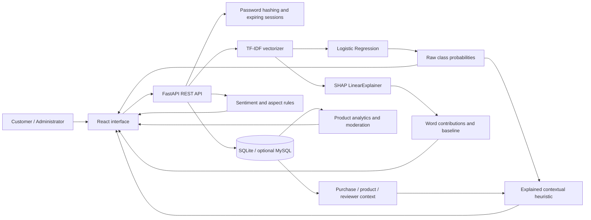
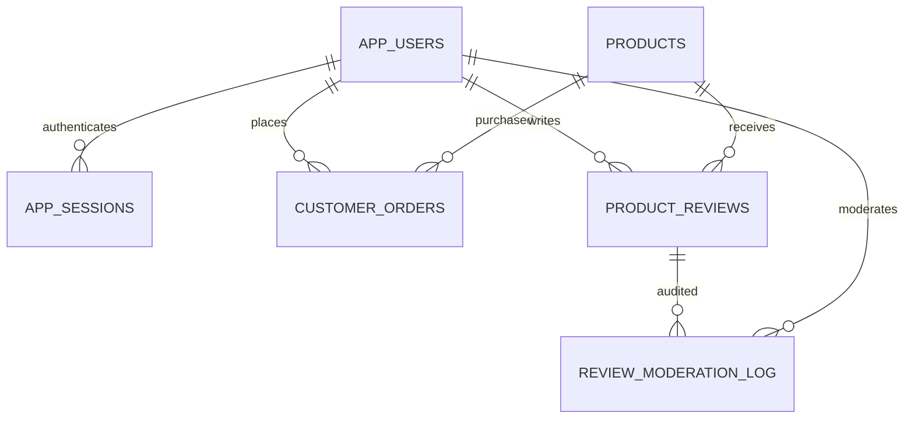

# AI-Powered Product Review Intelligence and Suspicious Review Detection System

## Abstract

Online reviews influence purchasing decisions, but a review's textual quality alone does not establish whether its author has purchased the product or whether the opinion is trustworthy. ReviewGuard combines a product catalogue, customer accounts, simulated order records, product-specific reviews and administrative moderation with an explainable text-classification pipeline. TF-IDF and Logistic Regression estimate whether a review resembles original or computer-generated training examples; SHAP identifies contributing words and phrases. Separate rules summarize sentiment, product aspects and contextual signals. The interface exposes these distinct forms of evidence so users can inspect model behavior instead of treating its prediction as proof. Product dashboards aggregate review trends and help administrators prioritize human review.

## Problem and objectives

The initial implementation accepted isolated review text and displayed a prediction. It lacked the product, customer and order context needed for a realistic review system. This upgrade preserves the existing classifier and adds a full workflow: browse a product, sign in, place a simulated order, submit a rated review, inspect its explanation and view aggregate feedback. Administrators can review suspicious content while preserving an audit trail.

The objectives are to integrate explainable ML into a working full-stack application, verify purchase status from database evidence, provide interpretable product feedback, support role-based moderation, and document evaluation honestly.

## Architecture

React communicates through `/api`. FastAPI validates inputs, derives customer identity from the session, retrieves trusted context and invokes the analysis service. Persistence is isolated in the database module. The model is cached after loading. The built frontend can be served by the same FastAPI process for a one-terminal local demonstration.

## Data model

`app_users` stores names, email addresses, salted password hashes, roles and demo flags. `app_sessions` stores hashed opaque tokens and expiration timestamps. `products` stores descriptions, prices and specifications. `customer_orders` stores customer/product relationships, quantities, price snapshots and completion status. `product_reviews` stores ratings, text, complete analysis JSON, summary fields and moderation status. A unique customer/product constraint prevents repeat reviews for the same product. `review_moderation_log` records status changes and the responsible administrator. Legacy standalone results remain in `review_history`.

Verified Purchase is computed by checking for a completed order for the same customer and product. Human verification changes moderation status only. Removed reviews remain in the database and in the author's history but are excluded from public review lists, ratings and analytics. Restoration reverses that exclusion.

## Algorithms and explainability

### Text representation

The TF-IDF vectorizer lowercases English text and uses unigrams and bigrams, a maximum vocabulary of 30,000 features, a minimum document frequency of two and sublinear term frequency. The vectorizer is fitted on the training partition; test text is transformed without fitting again.

### Logistic Regression

For feature vector x, the classifier computes z = b + w·x. The sigmoid maps z to the estimated probability of the computer-generated class. The class order is read from the saved estimator rather than assumed from array positions. Prediction confidence is the selected class's probability. It is not a measurement of the author's honesty.

### SHAP

The linear explainer uses the stored training-background matrix. The explanation satisfies approximately:

`model log-odds = SHAP baseline + sum(all feature contributions)`

Positive contributions move the model toward the suspicious class; negative contributions move it toward the original-review class. The UI highlights influential features present in the input. The API separately reports the full sum, omitted contributions and reconstruction error so the displayed top features are not mistaken for the entire model. SHAP explains associations used by this model, not a causal reason that a person wrote a review.

### Sentiment, aspects and contextual authenticity

Sentiment and aspect extraction use transparent English vocabulary, local context and negation rules. They support useful product summaries but are not advertised as a trained sentiment model. Product category/context and reviewer history add explainable signals to an authenticity heuristic. The score's individual signals and limitations are returned to the UI. Raw model probabilities are preserved separately.

Purchase verification is evidence of a recorded transaction in this application, not evidence of truthfulness. Repetition or rapid posting is a review-prioritization signal, not proof of coordinated behavior. The demonstration checkout intentionally creates simulated completed orders without a payment integration.

## Evaluation methodology

The supplied CSV uses OR and CG labels. Those distinguish original and generated text and are only a proxy for the application's suspicious-review question. The evaluation script reconstructs the original stratified 80/20 split with random seed 42 and checks vectorizer vocabulary, IDF weights and the saved SHAP background for consistency. Duplicate test text and training/test overlap are audited; exact details and measured scores are saved with artifact hashes. Because the original artifacts lack a signed training manifest, reconstruction strengthens reproducibility but does not establish full independent provenance.

The upgraded training script deduplicates before splitting, handles conflicting text labels and saves reproducible metadata. The supplied artifacts are preserved. Accuracy, per-class precision/recall/F1, ROC AUC, a confusion matrix and the majority baseline should be interpreted together. The evaluation JSON is the source of truth for numerical results; there is no invented success percentage in the interface.

## Security and integrity

Passwords use PBKDF2-HMAC-SHA256 with random salts and 600,000 iterations. Sessions use cryptographically random opaque tokens; only their SHA-256 digests are persisted. Logout revokes the stored session. The API enforces customer/admin authorization independently of the UI. User IDs, purchase flags, prices and roles are derived server-side rather than accepted as review input. Queries are parameterized. Input schemas bound lengths and ratings and reject unexpected fields. Moderation is reversible and auditable.

Shared demo credentials and synthetic records are clearly labelled. The application is intended for local academic demonstration. Commercial hardening, real payment integration and broad abuse protection are future work, not completed features.

## Testing and acceptance

Automated tests exercise signup/login/logout, access boundaries, session expiry, order ownership, server price calculation, verified/unverified reviews, duplicate submission, invalid inputs, moderation reversibility and aggregate consistency. Intelligence tests cover probability integrity, SHAP additivity, known/unknown vocabulary, negation and contextual signal separation. Build/lint and browser walkthrough results are recorded in `docs/VERIFICATION.md`.

## Contributions and limitations

The main contribution is integration: existing ML predictions gain inspectable product and purchase context, explanations are attached to persistent reviews, and analytics and moderation use the same stored evidence. This should be presented as an explainable review-intelligence prototype, not as a novel state-of-the-art fraud detector.

Limitations include English-focused features, a generated-text proxy target, domain shift, rule-based sentiment/aspects, heuristic contextual scoring, no real payment processing, and no external validation of purchase records. Future work can include independently labelled deceptive reviews, multilingual encoders, probability calibration, temporal reviewer graphs, stronger moderation workflows and real order integrations.

## References

- [scikit-learn TF-IDF documentation](https://scikit-learn.org/stable/modules/generated/sklearn.feature_extraction.text.TfidfVectorizer.html)
- [scikit-learn Logistic Regression documentation](https://scikit-learn.org/stable/modules/generated/sklearn.linear_model.LogisticRegression.html)
- [SHAP LinearExplainer documentation](https://shap.readthedocs.io/en/latest/generated/shap.LinearExplainer.html)
- [FastAPI application lifespan](https://fastapi.tiangolo.com/advanced/events/)
- [Python password hashing primitives](https://docs.python.org/3/library/hashlib.html)

The training CSV was already supplied with the project. Its original publisher and redistribution license must be verified from the original download before making claims about dataset authorship or publishing the data publicly.
